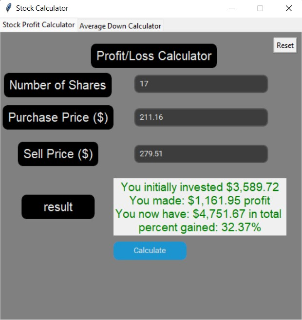

# Note
This repo contains unmaintened code

# Stock Calculator

A modern python GUI that gives users access to two calculators, a profit/loss calculator and an average up/down stock price calculator

## Author & Date 
- Author: [@hadisrour6](https://www.github.com/hadisrour6)
- Version: 1.0.0 
- Date: april 10, 2021 

## Requirments 
Install Python 3.7 or above. 

To install all dependencies, run:
```python
pip install -r requirements.txt
```

## User Documentation  
The first tab calculates the users profit/loss by entering the number of shares bought, at what price purchased and the price sold at.
As shown below: 



The second tab calculates the users current stock average price by entering the amount of shares bought at what prices up to 4 occasions. 
As Shown below:


