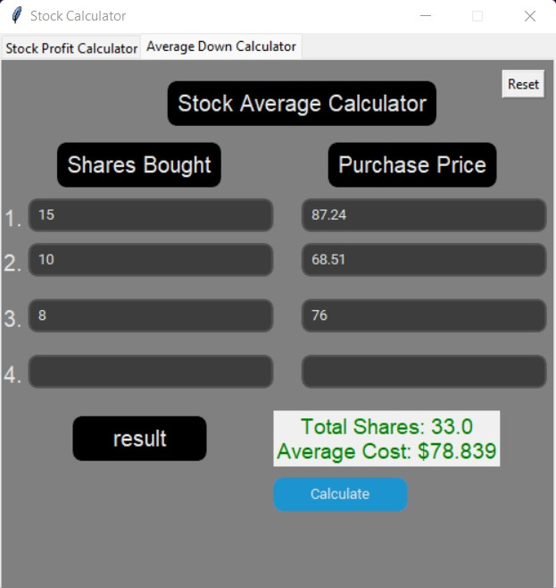

# Stock Calculator

A modern python GUI that uses tkinter and customtkinter to calculate profit/loss for a stock and/or users stock price average

The first tab calculates the users profit/loss by entering the number of shares bought, at what price purchased and the price sold at.
As shown below: 


The second tab calculates the users current stock average price by entering the amount of shares bought at what prices up to 4 occasions. 
As Shown below:




## Author & Date 
- Author: [@hadisrour6](https://www.github.com/hadisrour6)
- Version: 1.0.0 
- Date: april 10, 2021 


## Requirments
Install Python 3.6 or above. 

Run 
```python
pip install -r requirements.txt
```
to install dependencies.

To configure the DISCORD_TOKEN, there are two options: Create a .env in root and set DISCORD_TOKEN='YOUR TOKEN', or configure it in CONFIG.py and edit the comments in bot.py.

Edit the other TOKENS with your own tokens in CONFIG.py.

Run the bot with python3 bot.py.
Python 3.7 and over 


Python Libraries used: tkinter, Notebook, customtkinter


